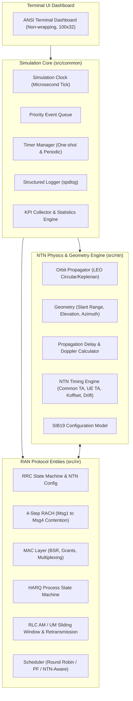

# System Architecture

## 1. Architectural Philosophy

The **NTN-Aware RAN Emulator** models the interaction between satellite physical propagation conditions and 3GPP 5G NR cellular protocol stacks (Releases 17/18).

Rather than using continuous-time RF DSP or cycle-by-cycle physical modeling, the emulator utilizes an **event-driven discrete-event simulation (DES)** core. Discrete events represent state transitions across protocol layers and physical propagation milestones, preserving microsecond-accurate timing alignment without unnecessary CPU overhead.

---

## 2. Layered Decomposition

---

## 3. Core Component Responsibilities

### 3.1. Discrete-Event Core (`src/common/`)
* **`SimulationClock`**: High-precision microsecond-resolution clock (`uint64_t` timestamp in microseconds).
* **`EventQueue`**: Min-heap priority queue ordering events chronologically by execution timestamp.
* **`TimerManager`**: Manages protocol timers (e.g., `ra-ResponseWindow`, `ra-ContentionResolutionTimer`, `t-PollRetransmit`, `ul-SyncValidityDuration`).
* **`StatisticsCollector`**: Collects runtime KPIs for aggregation and real-time visualization.

### 3.2. NTN Geometry & Timing Engine (`src/ntn/`)
* **`OrbitPropagator`**: Computes satellite position $(x(t), y(t), z(t))$ and velocity vector at simulation time $t$.
* **`SlantRange & Delay`**:
  $$\text{Slant Range } R(t) = \|\mathbf{r}_{\text{sat}}(t) - \mathbf{r}_{\text{ue}}(t)\|$$
  $$\text{One-Way Service Delay } \tau(t) = \frac{R(t)}{c}$$
  $$\text{Doppler Shift } f_d(t) = - \frac{f_c}{c} \cdot \frac{\mathbf{v}_{\text{rel}} \cdot \mathbf{r}_{\text{rel}}}{R(t)}$$
* **`NtnTimingEngine`**:
  Calculates uplink pre-compensation parameters:
  * Common Timing Advance ($T_{\text{common}}$)
  * UE-specific Timing Advance ($T_{\text{UE}}$)
  * Scheduling offset $K_{\text{offset}}$ for PUSCH/PUCCH/PRACH
  * TA drift rate $\dot{T}_{\text{TA}}$ and validity verification.

### 3.3. 3GPP RAN Protocols (`src/nr/`)
* **`RachController`**:
  * Preamble transmission (Msg1) over physical PRACH occasion.
  * Timing window validation for Msg2 (RAR) taking round-trip service delay into account.
  * Msg3 PUSCH scheduling with $K_{\text{offset}}$ applied.
  * Contention resolution timer (Msg4) with extended NTN duration.
* **`MacLayer & HarqManager`**:
  * Logical Channel Prioritization (LCP) and Buffer Status Reporting (BSR).
  * Extended HARQ feedback timelines and optional HARQ disabling per 3GPP TS 38.321 Rel-17.
* **`RlcAm`**:
  * Sequence numbering, transmit/receive sliding windows.
  * STATUS PDU generation, poll trigger, and poll retransmit handling under high RTT.
* **`Scheduler`**:
  * Baseline Terrestrial (Proportional Fair / Round Robin).
  * NTN-Aware: incorporates propagation delay, impending handover, and timing validity.

---

## 4. First Vertical Slice Implementation Path

To provide early demonstration and clear Git commits:
1. **Simulation Clock & Event Engine**
2. **LEO Satellite Movement & Slant Range Calculation**
3. **Dynamic Propagation Delay & $K_{\text{offset}}$ Timing**
4. **4-Step RACH Procedure with Timing Sensitivity**
5. **Real-time Terminal Dashboard displaying orbit, timing error, and RACH state transitions**.

